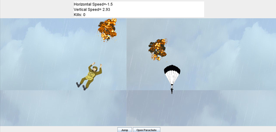

# ParatrooperGame
This is a simple java game developed in my freshman year.
In the game the player plays an American paratrooper descending from the skies.
The graphics library our game uses has been deprecated with the release of JDK 9. 
If you want to run this on your computer, make sure your have JDK 8 or earlier version.
This is what the game looks like:

